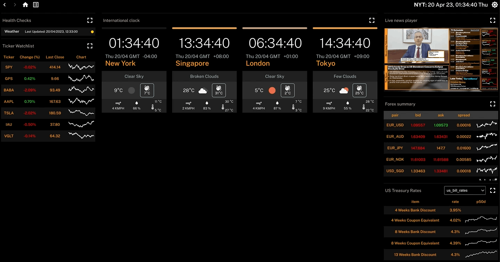
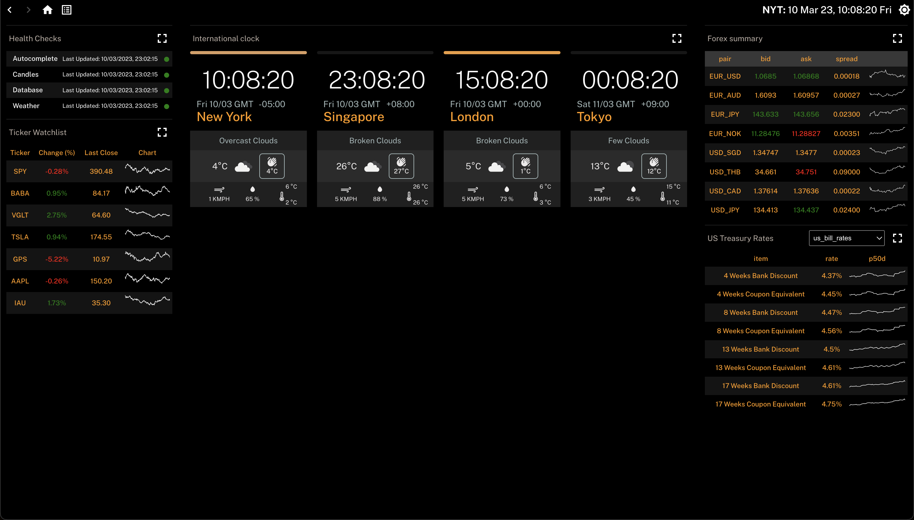
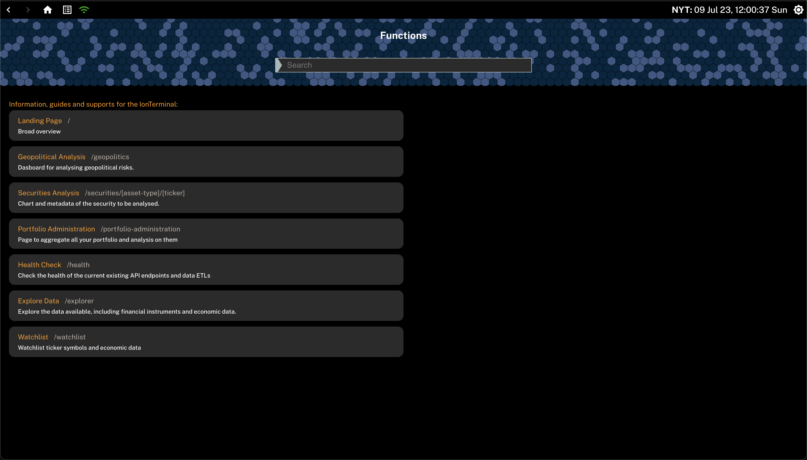
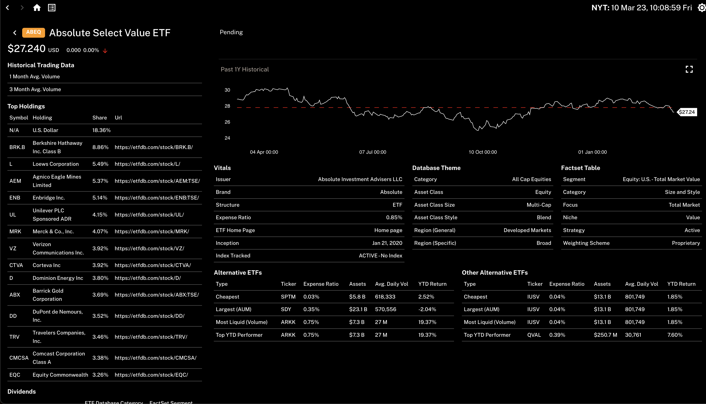
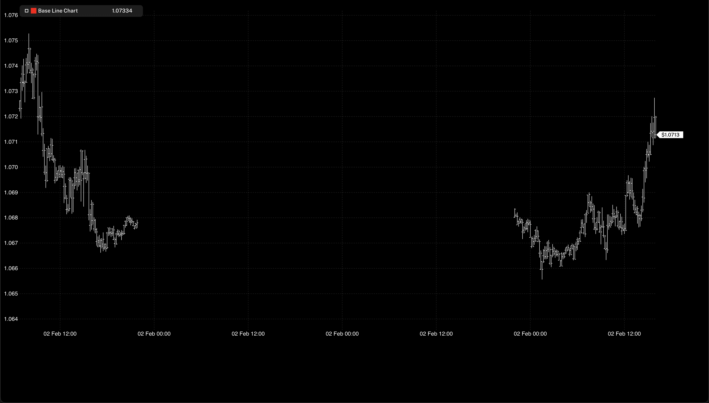
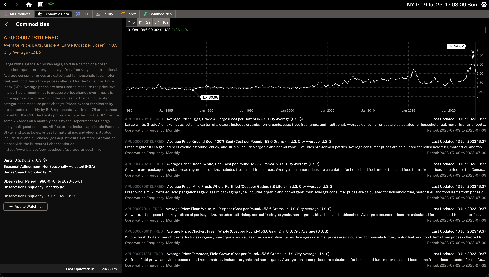

# Ion

Ion is a web application designed to leverage OSINT and APIs to create a centralised information hub for data driven trading/market intelligence. It is powered by powerful charting systems (d3 charting written in a plugin architecture to allow customisability) and comes with its own ETL Prefect pipeline that schedules data extraction for larger data sources.



## Features

---

|          Home Page           |            Available Functions            |
| :--------------------------: | :---------------------------------------: |
|  |  |

|           ETF Explorer           |             Chart Explorer             |
| :------------------------------: | :------------------------------------: |
|  |  |

|             FRED Economics            | 
| :-----------------------------------: | 
|  |

## Documentation

---

## Quick Start

---

#### Start base services - postgres, kafka servers. In `ion/docker`

```
docker compose -f "./docker-compose.base.yml" up
```

#### Start ETL pipelines. In `ion/data-engine`

```
prefect orion start
prefect agent start -q "common" "treasury"
python -m deployment
```

#### Start backend. In `ion/data-ingestion`

```
brew services start rabbitmq
uvicorn src.data_ingestion.app.main:app --reload --port 1236
```

#### Start frontend. In `ion/ion-frontend`

```
yarn start
```

## Architecture

---


- `ion-frontend` handles the UI/UX of Ion, including the dashboard and the features seen below.

- `data-ingestion` handles the extraction of data from the database that `data-engine` writes to.

- `ion-ingestion` handles the scraping of data that otherwise takes a long time to extract. E.g. Treasury data. This service writes to both MongoDB and PostgresSQL databases.

- `ion-clients` provides a unified package service that contains all of the code used by `data-ingestion` and `data-engine` services, including database schemas.

<br clear="left"/>

## Data Sources

---

|         Status         |                          Prompt                          |
| :--------------------: | :------------------------------------------------------: |
|         Online         |  |
| Work in Progress (WIP) |  |
|          Bug           |  |

|       Data Provider       |                   Data                   |      Repo       |                          Status                          |      Pages Using      |       Retrieval       |
| :-----------------------: | :--------------------------------------: | :-------------: | :------------------------------------------------------: | :-------------------: | :-------------------: |
|     Open Weather API      |                 Weather                  |   ion-clients   |  |     Home (Widget)     |       On-Demand       |
| US Department of Treasury |              Treasury Rates              |   ion-clients   |  |     Home (Widget)     |       Scheduled       |
|         Oanda API         |      Live and Historical Forex Data      |   ion-clients   |  |     Home (Widget)     |       On-Demand       |
|         Geonames          | Geographical Names with Lat and Lon Data |   ion-clients   |  | Home (Weather Widget) |       Scheduled       |
|           ETFDB           |        ETF Metadata and Database         | pyETFDB-scraper |  |       ETF List        | Scheduled + On-Demand |
|        Finnhub API        |      Daily Historical Ticker Prices      |   ion-clients   |  |       ETF List        |       On-Demand       |
|       USDA ESR API        | Agricultural Exports & Release Schedule  |    usda-api     |  |     To be Decided     | Scheduled + On-Demand |
|       USDA GATS API       |         Agricultural Trade Data          |    usda-api     |  |     To be Decided     | Scheduled + On-Demand |
|       USDA PSD API        |     Agricultural S&D Forecasts Data      |    usda-api     |  |     To be Decided     | Scheduled + On-Demand |
|         FRED API          |     US Federal Reserve Economic Data     |    fred-api     |  |     To be Decided     |       On-Demand       |
|          EIA API          |    US Official Energy Statistics Data    |     eia-api     |  |     To be Decided     |       On-Demand       |
|         News API          |    Live Internet News Aggregated Data    |    news-api     |  |     To be Decided     |       On-Demand       |

## References

---

**Academic Records**\
Probability and Statistics for Finance - Svetlozar, Rachev, Markus Hoechstoetter\
Stochastic calculus for finance I: The binomial asset pricing model - Steven E. Shreve\
Stochastic calculus for finance II Continuous time models - Steven E. Shreve\

[Financial Models for Numerical Methods](https://github.com/cantaro86/Financial-Models-Numerical-Methods)

**UI UX Design**\
Bloomberg Charting

## Contributing

---

Pull requests are welcome. For major changes, please open an issue first to discuss what you would like to change.

## License

---

[MIT](https://choosealicense.com/licenses/mit/)
