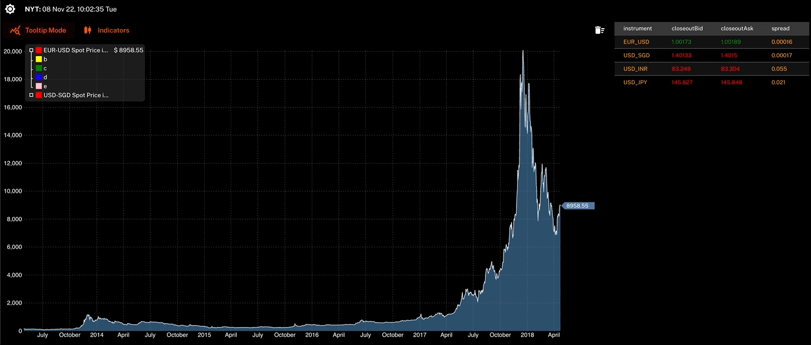

# Ion

Ion is a web application designed to leverage OSINT and common financial application features to create a centralised information hub for investment and CA decisions.

## Setup and Usage

docker-compose to be updated.

## Contributing

Pull requests are welcome. For major changes, please open an issue first to discuss what you would like to change.

## License

[MIT](https://choosealicense.com/licenses/mit/)
